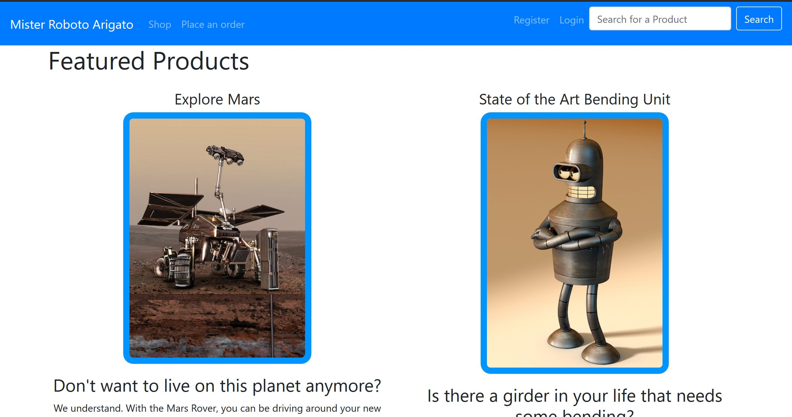
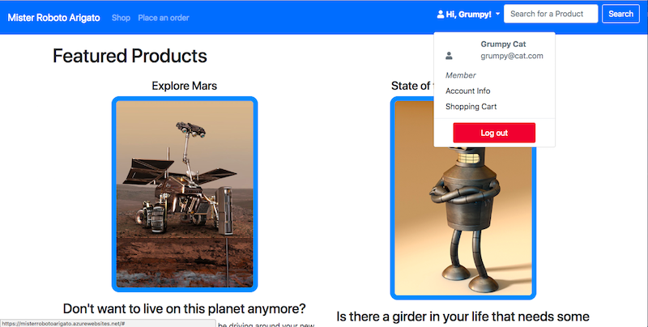
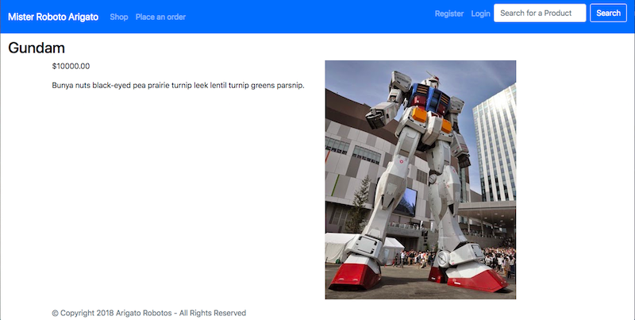
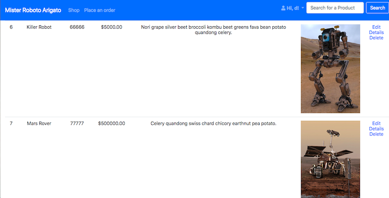
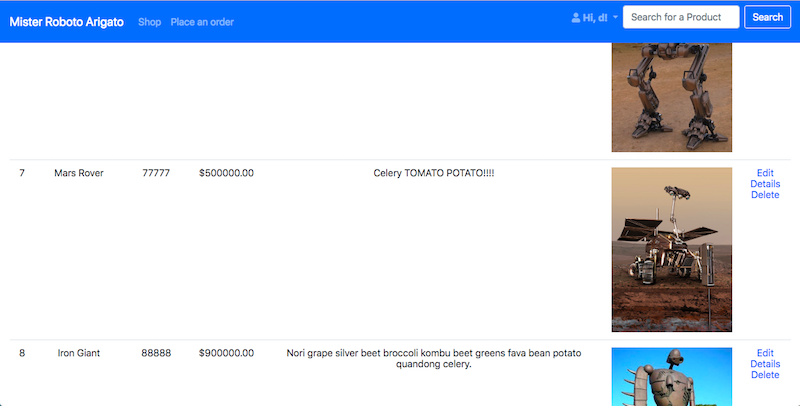
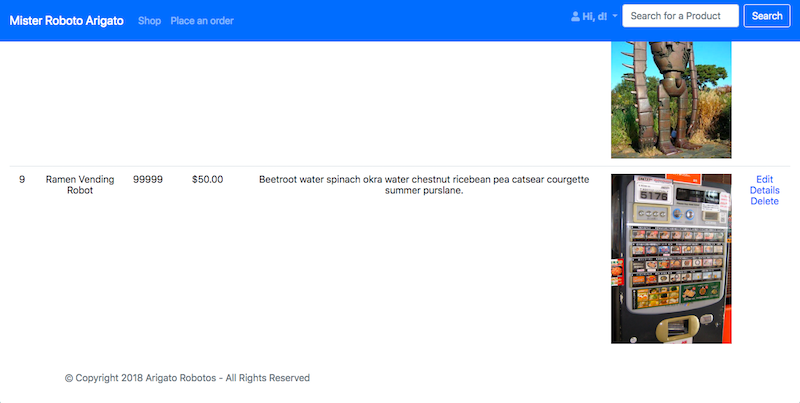

# Mister Roboto Arigato Store
This is a full stack C# ASP.NET MVC e-commerce store that sells ROBOTS!
The shop lives [here](https://misterrobotoarigato.azurewebsites.net).

**Authors**: Jackie L, Earl Jay Caoile <br />
**Version**: 1.0.0

---
## Overview
This project is a full stack web application that serves as an e-commerce website 
selling robots. The shop lives [here](https://misterrobotoarigato.azurewebsites.net).

#### Vulnerability Report
A report can be found [here](/vulnerability-report.md).

#### Registration, Login, and External Login (OAUTH)
The following tutorial was followed to add external logins: [Google](https://docs.microsoft.com/en-us/aspnet/core/security/authentication/social/google-logins?view=aspnetcore-2.1&tabs=aspnetcore2x)
and [Microsoft](https://docs.microsoft.com/en-us/aspnet/core/security/authentication/social/microsoft-logins?view=aspnetcore-2.1&tabs=aspnetcore2x)

After registration, users will receive a welcome email.  Users can still register 
and directly log in through the website rather than with an external party.

#### Claims
Upon registration, claims are taken of a user's email because that serves as their 
username.  The email claim is also set to their email which, connects the user to 
their basket and orders.  The other claims taken are of their first and last name 
because it is used to greet them when they land on the dashboard.  Additionally, 
every registered member is given a basket claim because we want to give an empty 
basket to every registered member.

#### Policies
The policies enforced are Admin and IsDoge.  Admin is enforced so that this admin 
can gain access to the admin dashboard and take care of inventory.  The other policy 
is IsDoge, which gives admin access to anyone with "Doge" in their login name; this 
policy was enforced because Doges have access to a secret page and Doges can get 
discounts. Doge is the best!!!

#### Shopping
From here, users are able to browse the store, and add whichever item they would like 
to their basket. They are able to add quantities of the item or remove an item form 
their basket. After checkout, users will receive an email of what they've purchased.

#### Checkout
After shopping, a user will be asked for their shipping information.  This will be 
stored in our database.  Users can have multiple orders.  

A special savings can be applied at checkout, but that's for you to discover!

#### Payment
Customers can pay with a fake credit card number upon checkout.  

Credit Card transactions are completed using the [Authorize.Net Sandbox.](https://sandbox.authorize.net/) 

#### Database Schema Visual


#### Database Schema Shortened Explanation
A user :
* is assigned 1 basket.
* can have multiple orders.
* can have multiple addresses.

An address can have multiple orders.

A basket can have multiple BasketItems.

A BasketItem can be made up of many products.

An Order is comprised of multiple OrderItems.

#### Database Schema Longer Explanation
_Product_ Products will have:
* an ID: to identify a product with a number
* Name: name of the product
* SKU: SKU of the product
* Price: how much a product costs
* Description: description about a product
* ImgUrl: a picture of the product

_Application User_ Users will have:
* First Name: the user's first name
* Last Name: the user's last name

_Basket_ Baskets will have:
* an ID: to identify every basket, so that we can grab its contents later
* CustomerEmail: baskets are given to users upon registration and is connected to 
  their email
* List of BasketItems: this is comprised of all the products being purchased

_Basket Items_ Items in a basket will have:
* an ID: to identify every item associated with a basket
* ProductID: the product ID that is tied to the basket
* ProductName: the name of the product tied to the basket
* CustomerEmail: the email of the customer buying the product, so we can associate 
  the customer with the product they're buying
* Quantity: the number of times of the product they're buying
* ImgUrl: the image tied to that product
* UnitPrice: how much that product costs

_Order_ Orders will have:
* an ID: identifies each order
* UserID: connect each customer to an order
* Shipping: the address of each customer
* List of OrderItems: ties this order to the item in the order, which is defined 
  in OrderItems
* Address ID: ID that connects an address to an order
* Address: The address associated with the Address ID
* DiscountName: name of the discount because we have 2 tiers
* DiscountPercent: percentage of the discount because we have 2 tiers

_OrderItems_ Order Items are the items on an Order:
* an ID: to identiyy each order
* OrderID: to identify each item on an order
* ProductID: to identify each product on an order
* UserID: to connect the user who is buying that product
* ProductName: the name of the product being bough
* Quantitiy: the number of items being bought
* ImgUrl: the picture of the item
* UnitPrice: how much that item costs

_Address_ Addressses will have:
* an ID: identifies each address
* FirstName: first name of the person this is being shipped to
* LastName: last name of the person this is being shipped to
* Street: street address of the customer, e.g street name
* Street2: street address 2 of the customer, e.g apartment #
* City: city that the person, this is being shipped, is living in 
* State: state that the person, this is being shipped, is living in 
* Country: country that the person, this is being shipped, is living in 
* Zip: zipcode that the person, this is being shipped, is living in 
* UserID: connects this address to a user

---
## Getting Started
The following is required to run the program.
1. Visual Studio 2017 Community or Enterprise edition.
2. The .NET desktop development workload enabled
3. ASP.NET NuGet packages
4. SendGrid, installed as a NuGet package

## Build
To run this locally, install the [.NET SDK package](https://www.microsoft.com/net/download/dotnet-core/2.1).
Clone this repo through a bash terminal and type the following commands:
```
cd MisterRobotoArigato
dotnet restore
dotnet bulid
dotnet run
```

---
## Architecture
This application is created using ASP.NET Core 2.1 Web Application <br />
*Languages*: C#, HTML, CSS, SCSS <br />
*Tools*: Azure, Visual Studio Team Services, SQL Database, SendGrid, Authorize.Net, Bootstrap <br />
*Type of Application*: Web Application <br />

---
## Walk Through Sprint 3
Mister Roboto Arigato has a new landing site!


Users can now view their account information.  
They can make changes to their first and last name.  
The dropdown link will reflect the change:


Upon checkout, customers can pay with a fake credit card that we've 
memorized for them:


Additionally, customers can see their purchase history:


On the admin side, there is new admin dashboard:


"View Recent Orders" will show the admin the most recent 20 orders:


The transaction appears on Authorize Net:


The merchant will be emailed a copy of the transaction:


---
## Walk Through Sprint 2
Mister Roboto Arigato now offers a third party login option:


Select either and the user will be redirected to the third party to login:


After the third party login, users will be redirected back to Mister Arigato 
Roboto where they will be prompted to "Register":


Instead of a third party login, users can register for a completely new 
account:


This step will prompt SendGrid to send a welcome email:


If the user were to logout and then log back in, they will receive another 
email welcoming them back:


This is the new shop view after the login process:


Let's go shopping.  Click 'Shop' from the navbar and let's buy an Iron Giant. 
Click "Add to Cart" 


The basket content page, a view component displaying items in the basket, 
persists on a product details page, which can be viewed if "View Basket Contents" 
is selected.  For now, let's navigate up to "My Basket" in the nav bar.


From here, users can update the quantity of an item.  We will be selecting 
3 and then "Update" for this example:


Select "Shop" from the navbar and let's continue shopping:


The basket content view component persists on the shop page as well as a 
product details page, let's have a look at the contents of the basket:


Click the X and close that view.  Scroll up on the shop page and view the 
details of any other item.  The Ramen Vending Robot looks good.  Click 
"Details" and then "Add to Cart":


Now go back to "My Basket" from the navbar.  You know, we've spent too much 
money so far.  Let's delete the Ramen Vending Robot from our basket:


This updated basket information persists to the checkout page.  Click on 
"Checkout" and we can now see the updated basket and total, without the 
Ramen Vending Robot.  From the checkout page, users will need to put in their 
shipping information:


Click "Checkout".  The confirm page will show a summary of the order:


When a user is on this page, an email receipt is on its way to their inbox:


---
## Walk Through Sprint 1

_Landing Page_



_Register An Account_

From here, anyone can register for an account.


_Non Admin/Regular Member View_



_Member Shop_

Clicking _Shop_ in the navbar will take members to the shop.


_Shop Details_

In the shop, clicking on the _Details_ link will take users 
to the product landing page where more details are shown.



_Admin Portal_

Any member who has an email with "doge" in it, will be an admin.


_Admin Dashboard_

Admins can view the entire inventory or add a product.


_Admin View All_

From View All, admins can edit the product description or delete the product.


_Admin Edit Product Info_

Let's edit a product info.


_Admin Edit Results_

The new edits will appear on the view all page.


_Admin Delete_

Another option is to delete a product from inventory. 
Let's delete the bee.


_Admin Delete Results_

The bee is now gone!



_Admin Add A Product_

From the admin dashboard, admins can add a product. 
Let's add the bee that was deleted.


_Admin Add Product Result_

The newly added bee is back on the inventory list!


